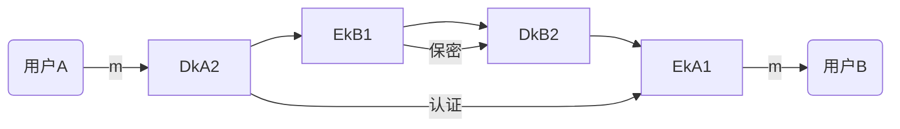
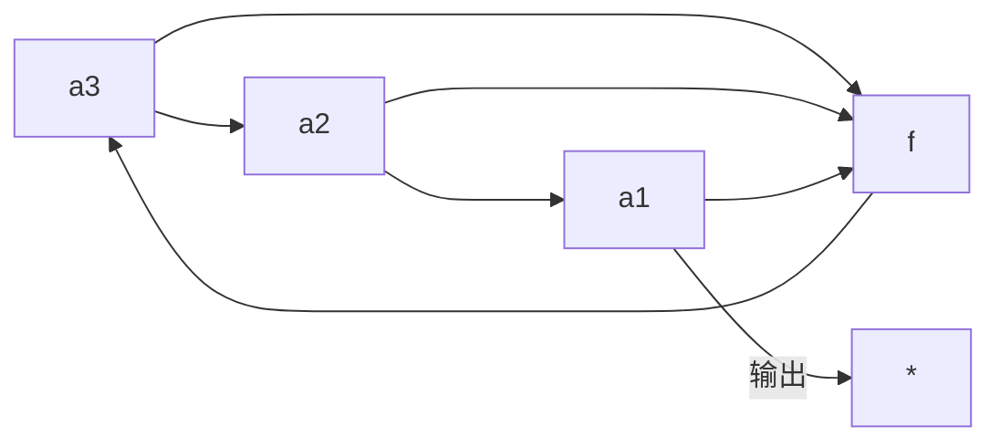

# [Crypto](https://github.com/SylverQG/Blogs/issues/3)

现代密码学目录(仅目录)


# 1. 基础
## 1.1 威胁
## 1.2 信息安全模型
## 1.3 密码学基本概念
## 1.4 古典密码

# 2. 流密码
## 2.1 基本概念
## 2.2 线性反馈移位寄存器
## 2.3 线性移位寄存器的一元多项式表达式
## 2.4 m序列的伪随机性
## 2.5 m序列密码的破译
## 2.6 非线性序列

# 3. 分组密码体制
## 3.1 概述
## 3.2 数据加密标准
## 3.3 差分密码分析与线性密码分析
## 3.4 分组密码的运行模式
## 3.5 IDEA
## 3.6 AES|Rijindael
## 3.7 SM4
## 3.8 祖冲之

# 4. 公钥密码
## 4.1 数学知识
## 4.2 基本概念
## 4.3 RSA
## 4.4 背包密码体制
## 4.5 NTRU
## 4.6 椭圆曲线密码体制
## 4.7 SM2椭圆曲线公钥密码加密算法

# 5. 密钥分配与密钥管理
## 5.1 单钥加密体制的密钥分配
## 5.2 公钥加密体制的密钥分配
## 5.3 随机数的产生
## 5.4 秘密分割

# 6. 消息认证与哈希函数
## 6.1 消息认证
## 6.2 哈希函数
## 6.3 MD5
## 6.4 安全哈希算法
## 6.5 HMAC
## 6.6 SM3

# 7. 数字签名和认证协议
## 7.1 基本概念
## 7.2 数字签名标准
## 7.3 其他签名方案
## 7.4 SM2椭圆曲线公钥密码签名算法
## 7.4 认证协议

# 8. 密码协议
## 8.1 基本协议
## 8.2 零知识证明
## 8.3 安全多方计算

# 9. 可证明安全
## 9.1 语义安全的公钥密码体制定义
## 9.2 语义安全的RSA的加密方案
## 9.3 Paillier公钥密码系统
## 9.4 Cramer-Shoup密码系统
## 9.5 RSA-FDH签名方案
## 9.6 BLS短签名方案
## 9.7 基于身份的密码体制

# 10. 网络加密与认证
## 10.1 网络通信加密
## 10.2 Kerberos认证系统
## 10.3 X.509认证业务
## 10.4 PGP

---

# 复习概要
# 一、引言
1. 密钥体制组成
   1. 明文、密文、密钥、加密算法、解密算法
2. 好的密钥体制
   1. 两类计算容易
      1. 已知明文和加密密钥
      2. 已知密文和解密密钥
   2. 一个不能
      1. 不知道解密密钥时，不能由密文推知明文
3. 攻击分析密码体制方法与应对方法
   1. 穷举攻击 $\rightarrow $增大密钥量
   2. 统计分析攻击 $\rightarrow $使得明文与密文的统计特征不一样
   3. 解密变换攻击 $\rightarrow $选择足够复杂的加密算法
4. 攻击的分类
   1. 自然攻击
      1. 自然灾害、电磁辐射、电磁干扰
   2. 人为攻击
      1. 外部攻击
         1. 被动攻击
            1. 内容信息获取(1)
            2. 数据业务流分析(2)
         2. 主动攻击
            1. 伪造(3)
            2. 篡改：内容修改(4)、顺序修改(5)、计时修改(6)
      2. 外部攻击
         1. 发送方否认(7)
         2. 接收方否认(8)
   3. 安全措施
      1. 数据保密:(1)(2)
      2. 消息认证:(3)(4)(5)(6)
      3. 数字签名:(7)(8)和部分的(3)(4)(5)(6)
5. 安全攻击的形式
   1. 中断
   2. 截取
   3. 伪造
   4. 篡改
   5. 重放
6. 密码分析分类
   1. 唯密文攻击：只知道一些密文
   2. 已知明文攻击：知道一些明文密文对
   3. 选择明文攻击：任意明文 $\rightarrow $密文
   4. 选择密文攻击：任意密文 $\rightarrow $明文
   5. 选择文本攻击：任意明文 $\leftrightarrow $任意密文
7. 密码体制分类
   1. 单钥密码体制
      1. 流密码
      2. 分组密码
   2. 双钥密码体制
      1. 加密密钥和解密密钥不同，DF提出，公钥k1与私钥k2
      2. 用户A用自己的私钥 $k_{A_2} $对消息m进行专用变换： $c=D_{k_{A_2}} $，将c给用户B
      3. 用户B验证m使用: $$m=E_{k_{A_1}}(c)=E_{k_{A_1}}(D_{k_{A_2}}) $$
      4. 双钥保密和认证体制
         1. 为了同时实现保密性和准确性，可以采用双重加解密


---

# 二、流密码
1. 基本概念
   1. 流密码将明文划分为字符（如单个字母），或其编码的基本单元（如0、1数字）
   2. 流密码强度完全依赖于密钥流生成器生成密钥流的`随机性`和`不可预测性`
   3. 同步流密码：密钥流产生算法与明文、密文无关
   4. 自同步流密码：密钥流产生算法与明文、密文相关
2. n级反馈移位寄存器
   1. GF(2)上的一个n级反馈移位寄存器由n个二元存储器与一个反馈函数 $f(a_1,a_2,…,a_n)$

这个怎么这么丑

一个三级反馈移位寄存器的状态和输出
| 状态( $a_3,a_2,a_1$) | 输出  |
| :------------------: | :---: |
|        1 0 1         |   1   |
|        1 1 0         |   0   |
|        1 1 1         |   1   |
|        0 1 1         |   1   |
|        1 0 1         |   1   |
|        1 1 0         |   0   |

3. 线性反馈移位寄存器(LFSR)
   1. 性质：完全由其反馈函数决定
   2. n级LFSR的状态最多有 $2^n$个
   3. n级LFSR的状态周期 $\le 2^n -1$
   4. 输出序列的周期=状态周期 $\le 2^n -1$
   5. 选择合适的反馈函数可以使序列达到最大值 $2^n -1$
   6. 周期达到最大值的序列称为`m序列`
   7. LFSR的特征多项式 $p(x)=1+c_1 x+c_2 x+…+c_{n-1}x_{n-1}+c_n x_n$
4. m序列
   1. 介绍在上
   2. 游程：连续的0或1的个数
   3. GF(2)上周期为T的序列 ${a_i}$的自相关函数
      1. 设 ${a_i}$ 满足线性递推关系: $a_{h+n}=c_1a_{h+n-1}\oplus c_2a_{h+n-2} \oplus … \oplus c_n a_h$
   4. m序列的破译

---

5. 例：设敌手获得密文串：101101011110010，
和相应明文串：011001111111001，
相应密钥流：110100100001011，求对应递推关系。
假定敌手还知道密钥流是使用5级线性反馈移位寄存器
解：分别用密文串中前十个比特和明文串中前十个比特建立如下方程

```math
(a_6,a_7,a_8,a_9,a_{10})=(c_5,c_4,c_3,c_2,c_1)
\begin{pmatrix}
a_1 & a_2 & a_3 & a_4 & a_5\\
a_2 & a_3 & a_4 & a_5 & a_6\\
a_3 & a_4 & a_5 & a_6 & a_7\\
a_4 & a_5 & a_6 & a_7 & a_8\\
a_5 & a_6 & a_7 & a_8 & a_9\\
\end{pmatrix}
\tag{1}
```
即：
```math
(0, 1, 0, 0, 0)=(c_5,c_4,c_3,c_2,c_1)
\begin{pmatrix}
1 & 1 & 0 & 1 & 0\\
1 & 0 & 1 & 0 & 0\\
0 & 1 & 0 & 0 & 1\\
1 & 0 & 0 & 1 & 0\\
0 & 0 & 1 & 0 & 0\\
\end{pmatrix}
\tag{2}
```
求矩阵的逆矩阵：
```math
\begin{pmatrix}
1 & 1 & 0 & 1 & 0\\
1 & 0 & 1 & 0 & 0\\
0 & 1 & 0 & 0 & 1\\
1 & 0 & 0 & 1 & 0\\
0 & 0 & 1 & 0 & 0\\
\end{pmatrix}^{-1}
=
\begin{pmatrix}
0 & 1 & 0 & 0 & 1\\
1 & 0 & 0 & 1 & 0\\
0 & 0 & 0 & 0 & 1\\
0 & 1 & 0 & 1 & 1\\
1 & 0 & 1 & 1 & 0\\
\end{pmatrix}
\tag{3}
```
从而
```math
(c_5,c_4,c_3,c_2,c_1)=(0, 1, 0, 0, 0)
\begin{pmatrix}
0 & 1 & 0 & 0 & 1\\
1 & 0 & 0 & 1 & 0\\
0 & 0 & 0 & 0 & 1\\
0 & 1 & 0 & 1 & 1\\
1 & 0 & 1 & 1 & 0\\
\end{pmatrix}
\tag{4}
```
```math
(c_5,c_4,c_3,c_2,c_1)=(1, 0, 0, 1, 0)\tag{5}
```
则密钥流的递推关系为
```math
a_{i+5} = c_5 a_i\oplus c_2a_{i+3} =a_i\oplus a_{i+3}
```

---

# 三、置换密码
1. 置换
   1. 置换密码又叫做换位密码，根据一定的规则重新排列明文，打破明文的结构特性。特点是保持明文所有的字符不变，仅仅打乱明文字符的位置和次序。
2. 常见的置换密码有
   1. 列置换密码：明文遵照密钥的规则按照列换位并且按照列得到密文
   2. 周期置换密码：将明文按照固定的长度进行分组，然后对每组按照某种重新排列得到密文
3. 例：设有限集 $X = \{ 1,2,3,4,5,6,7,8 \}, \sigma$ 为 $X$上的一个置换，并且满足 $\sigma (1)=2, \sigma (2)=5, \sigma (3)=3, \sigma (4)=6, \sigma (5)=1, \sigma (6)=8, \sigma (7)=4, \sigma (8)=7,$ 因为置换可以对换表示，所以上述置换 $\sigma $可以形式化为:
```math
\sigma=\begin{pmatrix}
1 & 2 & 3 & 4 & 5 & 6 & 7 & 8\\
2 & 5 & 3 & 6 & 1 & 8 & 4 & 7
\end{pmatrix}
=
(125)(3)(4687)
=
(125)(4687)
```
则其逆置换 $\sigma ^{-1}$可表示为：
```math
\sigma ^{-1}=\begin{pmatrix}
1 & 2 & 3 & 4 & 5 & 6 & 7 & 8\\
2 & 5 & 3 & 6 & 1 & 8 & 4 & 7
\end{pmatrix}^{-1} \\
=
\begin{pmatrix}
1 & 2 & 3 & 4 & 5 & 6 & 7 & 8\\
5 & 1 & 3 & 7 & 2 & 4 & 8 & 6
\end{pmatrix}
=(152)(3)(4786)=(152)(4786)
```

4. 例：
   - 明文：cryptograph is an applied science
   - 密钥：encry
   - 求密文

```math
\sigma=\begin{pmatrix}
2 & 3 & 1 & 4 & 5\\
c & r & y & p & t\\
o & g & r & a & p\\
h & y & i & s & a\\ 
n & a & p & p & l\\ 
i & e & d & s & c\\
i & e & n & c & e
\end{pmatrix}
=
\begin{pmatrix}
1 & 2 & 3 & 4 & 5\\
y & c & r & p & t\\
r & o & g & a & p\\
i & h & y & s & a\\ 
p & n & a & p & l\\ 
d & i & e & s & c\\
n & i & e & c & e
\end{pmatrix}
```

则 密文： ycrpt rogap ihysa pnapl diesc niece

5. 周期置换密码
   1. 周期置换密码是将明文串P按固定长度m分组，然后对每组中的子串按1,2,…,m的某个置换重排位置从而得到密文C。其中密钥 $\sigma $包含分组长度信息。解密时同样对密文C按照长度m分组，并按照 $\sigma$ 的逆置 $\sigma ^{-1}$把每组子串冲核心排列位置从而得到明文P
   2. 例：
      1. 明文："State key Laboratory of Networking and  Switching";加密密钥： $\sigma = (1\ 5\ 6\ 2\ 3)$
      2. 将明文分为7组：(Statek)(eyLabo)(ratory)(ofNetw)(orking)(andSwi)(tching)
      3. 加密变换：(aKttSe)(Loyaeb)(tyaorr)(Nwfeot)(kgrion)(dinSaw)(hgcitn)
      4. 最终密文：(aKttSeLoyaebtyaorrNwfeotkgriondinSawhgcitn)
      5. 由加密密钥易知解密密钥： $\sigma ^{-1}=(1\ 3\ 2\ 6\ 5)$

---

6. 代换密码
   1. 代换，就是明文中的一个字母由其他字母、数字或者符号替代的一种方法
   2. 代换密码就是建立一个代换表，加密时将需要加密的明文依次通过查表，替换为相应的字符，明文字符被逐个替换后，生成无任何意义的字符串，即密文。这样的代换表被称之为密钥
   3. 代换密码的分类
      1. 依据：按照一个明文字母是否总是被一个固定的字符代换进行划分。
      2. 单表代换：(凯撒、仿射)：对明文消息中出现的同一个字母，在加密时都使用同一固定的字母来代换，不管他在什么地方。
      3. 多表代换：(维吉尼亚、Playfair、转轮)：明文消息中出现的同一个字母，在加密时不是完全被同一固定的字母代换，而是根据其出现的位置次序，用不同的字母代换。
   4. 例：
      ```math
      密钥=\begin{Bmatrix}
      a & b & c & d & e & f & g & h & i & j & k & l & m & n & o & p & q & r & s & t & u & v & w & x & y & z\\
      f & q & i & s & h & n & c & v & j & t & y & a & u & w & d & r & e & x & l & b & m & z & o & g & k & p
      \end{Bmatrix}
      ```
      ```math
      \begin{matrix}
      & to  & be & or & not & to & be\\
      加密 &\downarrow\downarrow & \downarrow\downarrow &\downarrow\downarrow &\downarrow\downarrow\downarrow &\downarrow\downarrow &\downarrow\downarrow\\
      & bd & qh & dx & wdb & bd & qh\\
      解密 &\downarrow\downarrow & \downarrow\downarrow &\downarrow\downarrow &\downarrow\downarrow\downarrow &\downarrow\downarrow &\downarrow\downarrow\\
      & to  & be & or & not & to & be\\
      \end{matrix}
      ```
   5. 仿射密码
      1. 加密： 
      ```math
       e_k(x)=x+k(mod\ 26)=y\in C
       ```
      2. 解密： 
      ```math
      x=d_k(y)=y-k(mod\ 26)
      ```

---

7. DES
   1. 基本参数
      1. 分组加密算法：明文和密文为64位分组长度
      2. 对称算法：加密和解密除密钥编排不同外，使用同一算法
      3. 密钥长度：有效密钥56位，但每个第8位为奇偶校验位，可忽略
      4. 密钥可为任意的56位数，但存在弱密钥，容易避开
      5. 采用混淆和扩散的组合，每个组合先替代后置换，共16轮
      6. 设明文$m=(L_0 , R_0)$,则DES的加密过程可描述为：
```math
\begin{cases}
L_i = R_{i-1}\\
R_i = L_{i-1}\oplus f(R_{i-1},K_i), i=1,2,…,16\\
\end{cases}
```
DES的第 $i$ 圈加密结构图

```math
\begin{matrix}
L_{i-1}(32位)& &  & & R_{i-1}(32位) & &\\
\downarrow & & & &\downarrow\\
\downarrow & & \downarrow &\leftarrow &\leftarrow &\leftarrow & K_i\\
\oplus & \longleftarrow & f & \leftarrow &\downarrow \\
(L->>R)&&&&(R->>L)\\
L_i(32位)&&&&R_i(32位)
\end{matrix}
```

8. 分组密码的工作模式
   1. 分类
      1. 电码本(ECB)模式
      2. 密码分组链接(CBC)模式
      3. 密码反馈(CFB)模式
      4. 输出反馈(OFB)模式
      5. 计数器(CTR)
   2. 总评
      1. ECB模式简单、高速，但最弱，易受重发和替换攻击，一般不采用
      2. CBC，CFC，OFB模式的选用取决于实际的特殊需求
      3. 明文不易丢信号，对明文的格式没有特殊的要求的环境可选用CBC模式。需要完整性认证功能时也可以选用该模式
      4. 容易丢信号环境下，对明文格式有特殊要求的环境，可以选用CFB模式
      5. 信号特别容易错，但明文冗余特别多，可选用OFB模式

9. AES
   1.  理论基础
       1. 字节运算：AES中一个字节三有限域GF(28)上的元素表示，通过倍成函数time()实现
       2. 字运算：AES中的32位字表示为系数在有限域GF(28)上的次数小于4的多项式，即$a(x)=a_3 x^3+ a_2 x^2 +a_1 x +a_0$
    2. AES加密
       1. AES密码是一种迭代式密码结构，但不是Feistel结构
       2. 对于AES算法，算法的轮数依赖于密钥长度： $将轮数表示N_r，当N_k=4, N_r=10, 当N_k=6, N_r=12 ; 当N_k=12,N_r=14。【其中：密钥的列数记为 N_k, N_k=密钥长度(bits)\div 32(bits)。 N_k 可以取为4、6和8，对应和密钥长度分别为128位、192位和256位】$
       3. 加密过程：（以128为例）
          1. AES需要迭代十轮，需要11个子密钥
          2. 前面9轮完全相同，每轮包括4个阶段，分别是字节代换(SubBytes)、行移位(ShiftRows)、列混淆(MixColumns)和轮密钥加(AddRoundKey)；最后一轮只3个阶段，减少列混淆。
          3. 例
```[]mermaid
graph TB
start[明文]-->a1(轮密钥加)
   subgraph 第一轮
      a1-->a2(字节代换)
      a2-->a3(行移位)
      a3-->a4(列混淆)
      a4-->a5(轮密钥加)
   end
   a5--…-->c1(轮密钥加)
   subgraph 第九轮
      c1-->c2(字节代换)
      c2-->c3(行移位)
      c3-->c4(列混淆)
      c4-->c5(轮密钥加)
   end
   c5-->d1(字节代换)
   subgraph 第十轮
      d1-->d2(字节代换)
      d2-->d3(行移位)
      d3-->d5(轮密钥加)
   end
   subgraph key
      direction TB
      b1("子密钥w[0,3]")-->a1
      b2("子密钥w[4,7]")-->a5
      b3("子密钥w[36,39]")-->c5
      b4("子密钥w[40,43]")-->d5
   end
   d5-->密文
```

   3. AES解密:加密的逆过程
   4. AES安全性：
      1. 抵抗差分分析和线性分析（基于轨迹策略）
      2. 抵抗举密钥攻击
      3. 对密钥的选择没有任何限制，还没有发现弱密码和半弱密码的存在

---

# 四、公钥密码
## 4.1 数学基础
1. 代数系统
   代数系统是对要研究的现象或过程建立起的一种数学模型，模型中包括要处理的数学对象的集合以及集合上的关系或运算
   运算可以三一元的也可以三多元的，可以有一个也可以有多个
2. 封闭性
   设 $\ast $是集合S上的运算，若对 $\forall a,b \in S $, $a\ast b \in S $, 则称S对运算 $\ast$是封闭的
   若 $\ast$是一元运算，若对 $\forall a \in S $, $\ast b \in S $, 则称S对运算 $\ast $是封闭的
3. 结合律
   若对 $\ast a,b,c \in S,有 (a \ast b)\ast c = a\ast (b\ast c),$则称 $\ast $满足结合律
4. 半群
   1. 设 $\lt G,\ast \gt $是一个代数系统， $\ast $满足：
      1. 封闭性
      2. 结合律
   2. 则称 $\lt G,\ast\gt $是半群
5. 群
   设 $\lt G,\ast\gt $是一个代数系统， $\ast $满足：
      1. 封闭性
      2. 结合律
      3. 存在元素e，对 $\forall a\in G,$有  $a \ast e = e\ast a = a$。 $[e称为\lt G,\ast\gt 的单位元]$
      4. 对 $\forall a\in G,\exists元素a^{-1} $使得 $a\ast a^{-1} = a^{-1} \ast a = e $。 $[称为a^{-1}为元素a的逆元]$
   
   则称 $\lt G,\ast\gt $是群
6. 有限域&无限域
   如果G是有限集合，则称 $\lt G,\ast\gt $是有限群，否则三无限群。有限群中， $G $的元素个数称为群的阶数
7. Abel(交换群)
   如果群 $\lt G, \ast>$中的运算 $\ast $还满足交换律，即对 $\forall a,b \in G, 有 a \ast b = b\ast a$,称 $\lt G, \ast\gt $为Abel群或交换群
8. 群中运算 $\ast$一般为乘法，称该群为乘法群
   若运算 $\ast $改为 +，则成为加法群。此时逆元 $a^{-1}写成-a$
9. 循环群
   设 $\lt G,\ast\gt $是一个群，I是整数集合。如果存在一个元素 $g\in G$,对于每一个元素 $a\in G$,都有一个相应的 $i\in I$, $能把a表示成g^i$,则称 $\lt G,\ast\gt $,是循环群，g称为循环群的生成元。
10. 环
   若代数系统 $\lt R,+,\ast>$的二元运算 $+和\ast$满足：
       1.  $\lt R,+>$是Abel群
       2.  $\lt R,\ast>$是半群
       3. 乘法 $\ast$在加法 $+$上可分配，即：
         对 $\forall a,b,c \in R,有a\ast (b+c)=a\ast b + a\ast c 和(b+c)\ast a=b\ast a+c\ast a$
   
      则称 $\lt R,+,\ast\gt 是环$
11. 域
   若代数系统 $\lt F,+,\ast\gt $的二元运算 $+和\ast 满足$:
      1.  $\lt F,+>$是Abel群
      2.  $\lt F-\{0\},\ast\gt $是Abel群，其中0是+的单位元
      3. 乘法 $\ast $在加法+上分配，即：
         对 $\forall a,b,c \in R,有a\ast (b+c)=a\ast b + a\ast c 和(b+c)\ast a=b\ast a+c\ast a$
      
      则称 $\lt F,+,\ast\gt $是域
12. 有限域
   有限域是指域中元素个数有限的域，元素个数成为域的阶

13. Galois域
   若q是素数的幂，即 $q=p^r$，其中p是素数，r是自然数，则阶为q的域称为Galois域，记为GF(q)或是Fq

14. 同余，同余类
   如果 $(a\ mod\ n)=(b\ mod\ n)$，则称两整数a和b模n同余，记为 $a\equiv b\ mod\ n$。称与a模n同余的数的全体为a的同余类，记为 $\lceil a\rceil$，称a为这个同余类的表示元素
15. 费马定理[Fermat定理]
   若P是素数，a是正整数且 $gcd(a,p)=1,则a^{p-1}\equiv 1\ mod\ p$
   Fermat定理也可以写成如下形式：
   设p是素数，a是任意正整数， $a^p\equiv a\ mod\ p$
16. 欧拉函数
   设n是一正整数，小于n且与n互素的正整数的个数成为n的欧拉函数，记为 $\phi (n)$若n是素数，则显然 $\phi (n)=n-1$
17. 欧拉定理(Euler)
   若a和n互素，则 $a^{\phi (n)}\equiv 1\ mod\ n$

18. 欧几里德算法(Euclid)
   1.  求最大公因子：Euclid算法是基于下面的一个基本结论
```math
对任意的非负整数a和正整数b，有gcd(a,b)=gcd(b,a\ mod\ b)
```
   2. 求乘法的逆元：如果gcd(a,b)=1,则b在moda下有乘法逆元(不妨设 $b< a$),即存在一个 $x(x< a)$,使得 $b x \equiv (1\ mod\ a) $，推广的Eucild算法先求出gcd(a,b),当gcd(a,b)=1时，则返回b的逆元

---

## 4.2 公钥密码体制
1. 特点
   1. 公钥密码算法最大的特点就是采用两个相关的密钥将加解密分开，其中一个密钥是公开的，称为公钥，用于加密；另一个密钥是为用户专用，因而保密，称为密钥，用来解密。因此公钥密码体制也称之为双钥密码体制。
   2. 算法有以下特性：已知密码算法和加密密钥，求解密密钥在计算上的不可行的
2. 公钥体制加密

3. 公钥密码体制认证

4. 公钥密码体制认证、保密


5. 公钥密码算法应该满足的要求
   1. 接收方B产生密钥对(公钥PKB和密钥SKB)在计算上是容易的
   2. 发送方A用接收方的公开密钥对消息m加密以产生密文c，即 $c=E_{PKB}(m)$，在计算上是容易的
   3. 接收方B用自己的密钥对c解密，即 $m=D_{SKB}(c)在计算上是容易的$
   4. 敌手由B的公钥PKB求解密钥SKB在计算上是不可行的
   5. 敌手由密文c和接收方B的公钥PKB恢复明文m，在计算上是不可行的
   6. 加密、解密次序可以调换，即 $E_{PKB}[D_{SKB}(m)]=D_{SKB}[E_{PKB}(m)]$
   7. **以上要求的本质在于要求一个单向陷门函数**
6. 对公钥密码体制的攻击
   1. 和单钥密码体制一样，如果密钥太短，公钥密码体制也容易受到穷举搜索攻击。因此密钥必须足够长才能抵抗穷举搜索攻击。然而又由于公钥密码体制所使用的可逆函数的计算复杂性与密钥长度常常不是线性关系，而是增大得更快。
   2. 公钥密码体制目前主要用于密钥管理和数字签名
   3. 对公钥密码算法的第二种攻击是寻找从公钥计算密钥的方法。目前为止，常用公钥算法还未能够证明这种攻击是不可行的
   4. 还有一种仅适用于对公钥密码的攻击方法，称为可能字攻击。因此不管公钥密码算法的密钥多长，这种攻击的本质是对56比特的DES密钥的穷举搜索攻击。抵抗方法是在欲发送的明文消息后添加一些随机比特。